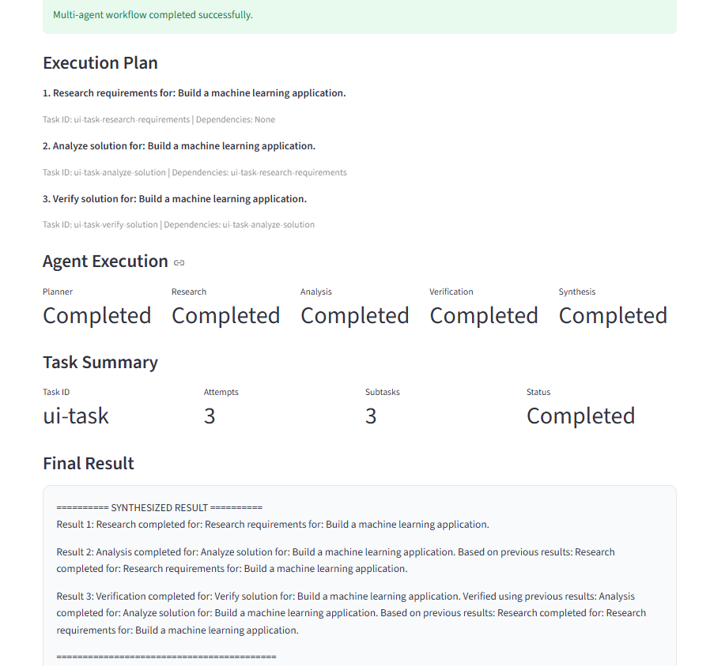

# Autonomous Multi-Agent Task Orchestrator

An autonomous multi-agent system that breaks complex goals into smaller tasks, assigns them to specialized agents, manages dependencies, handles failures and retries, persists task state, and recovers incomplete tasks after a restart.
## Project Dashboard



*Live dashboard showing the execution plan, agent statuses, task summary, and final synthesized result.*

## Project Overview

The Autonomous Multi-Agent Task Orchestrator demonstrates how multiple specialized agents can collaborate to solve complex tasks through a structured execution workflow.

Instead of executing a task as one large operation, the system:

1. Receives a user goal
2. Creates an execution plan
3. Breaks the goal into subtasks
4. Assigns subtasks to specialized agents
5. Manages task dependencies
6. Passes results between agents
7. Handles failures and retries
8. Verifies task results
9. Synthesizes the final result
10. Persists task state
11. Recovers incomplete tasks after a restart

## Architecture

```text
                        User Goal
                            |
                            v
                     +-------------+
                     |   Planner   |
                     +------+------+
                            |
                            v
                     +-------------+
                     | Task Manager|
                     +------+------+
                            |
             +--------------+--------------+
             |              |              |
             v              v              v
        +---------+    +---------+    +-------------+
        | Research|    | Analysis|    | Verification|
        |  Agent  |    |  Agent  |    |    Agent    |
        +----+----+    +----+----+    +------+------+
             |              |                 |
             +--------------+-----------------+
                            |
                            v
                     +-------------+
                     |  Synthesis  |
                     |    Agent    |
                     +------+------+
                            |
                            v
                       Final Result

                  +----------------------+
                  | Memory / Persistent  |
                  | State                |
                  |                      |
                  | - Results            |
                  | - Task Status        |
                  | - Attempts           |
                  | - Dependencies       |
                  | - Execution History  |
                  +----------------------+
                  ## Specialized Agents

### Planner Agent

Creates a structured execution plan and identifies task dependencies.

### Research Agent

Handles research-oriented subtasks and produces research results.

### Analysis Agent

Analyzes previous results and generates analytical outputs.

### Verification Agent

Validates and verifies the results produced by previous agents.

### Synthesis Agent

Combines results from multiple agents into a structured final response.

## Core Features

- Multi-agent task orchestration
- Structured task planning
- Agent registry and capability detection
- Dependency-aware execution
- Agent-to-agent result passing
- Failure handling
- Configurable retry policy
- Retry attempt tracking
- Persistent task state
- JSON-based memory
- Task serialization and reconstruction
- Incomplete-task detection
- Restart recovery
- Dependency-aware recovery
- Dependency blocking
- Dependency deadlock protection
- Completed-task recovery protection
- Full workflow integration testing
- Local/offline LLM planning for development

## Recovery Workflow

The orchestrator stores task state so that incomplete work can be recovered after a restart.

```text
Running Task
     |
     v
Persistent Memory
     |
     v
Application Restart
     |
     v
Detect Incomplete Tasks
     |
     v
Reconstruct Task State
     |
     v
Check Dependencies
     |
     +---- Dependency incomplete
     |          |
     |          v
     |       Wait / Block
     |
     +---- Dependencies complete
                |
                v
          Resume Execution
                |
                v
          Store New State
```

## Dependency Handling

The system supports dependency-aware execution.

For example:

```text
Research Task
      |
      v
Analysis Task
      |
      v
Verification Task
      |
      v
Synthesis
```

A dependent task will not execute until its required dependencies have completed.

The recovery system also detects dependency deadlocks and stops safely instead of entering an infinite execution loop.

## Retry Mechanism

Failed agent executions can be retried using a configurable retry policy.

Example:

```text
Maximum retries = 2

Attempt 1 -> Failed
Attempt 2 -> Failed
Attempt 3 -> Final attempt
```

The system tracks the number of attempts for each task.

## Persistent Memory

Task information is persisted using JSON storage.

Stored information includes:

- Task ID
- Goal
- Status
- Result
- Error information
- Attempt count
- Dependencies
- Parent task
- Execution history

This allows the system to recover incomplete work after restarting the application.

## Testing

The project includes tests covering:

- Task management
- Task serialization
- Task reconstruction
- Memory storage
- Memory persistence
- Task state persistence
- Retry policy
- Agent registry
- Planner
- Plan schema
- Research Agent
- Verification Agent
- Synthesis Agent
- Dependency handling
- Dependency execution order
- Recovery
- Restart recovery
- Completed-task protection
- Blocked dependencies
- Dependency deadlocks
- Full workflow integration

## Technology Stack

- **Python**
- **Pydantic**
- **JSON**
- **Agent-based architecture**
- **PowerShell / VS Code**
- **Git & GitHub**
- **Streamlit**

The current development version uses a local mock LLM service, so an external paid API is not required to run the core workflow.

## Project Structure

```text
autonomous-multi-agent-orchestrator/
|
+-- agents/
|   +-- core/
|   |   +-- models.py
|   |   +-- memory.py
|   |   +-- orchestrator.py
|   |   +-- task_manager.py
|   |   +-- retry_policy.py
|   |   +-- agent_registry.py
|   |   +-- llm_service.py
|   |
|   +-- planner/
|   +-- research/
|   +-- analysis/
|   +-- verification/
|   +-- synthesis/
|
+-- backend/
+-- database/
+-- docker/
+-- docs/
+-- frontend/
+-- tests/
|
+-- requirements.txt
+-- README.md
+-- .gitignore
```

## Running the Project

### 1. Clone the repository

```bash
git clone <your-github-repository-url>
cd autonomous-multi-agent-orchestrator
```

### 2. Create a virtual environment

```bash
python -m venv .venv
```

### 3. Activate the virtual environment

Windows PowerShell:

```powershell
.venv\Scripts\Activate.ps1
```

### 4. Install dependencies

```bash
pip install -r requirements.txt
```

### 5. Run the Streamlit dashboard

```powershell
python -m streamlit run frontend/app.py
```

### 6. Run the full workflow test

```powershell
python -m agents.core.test_full_workflow
```

## Example

Enter a goal such as:

```text
Build a machine learning application
```

The system creates a dependency-aware execution plan:

```text
Research Requirements
        |
        v
Analyze Solution
        |
        v
Verify Solution
        |
        v
Synthesize Results
```

The Streamlit dashboard displays the execution plan, agent execution status, task summary, attempts, and final synthesized result.

## Current Status

The core orchestration workflow, multi-agent execution, dependency management, retry handling, persistent state, restart recovery, and Streamlit dashboard have been implemented and tested.

The project has passed full workflow, restart recovery, dependency-aware recovery, and dependency deadlock tests.

## Author

**Aishwarya M M**

Computer Science Engineering Student

---

If you find this project useful, consider giving the repository a star.